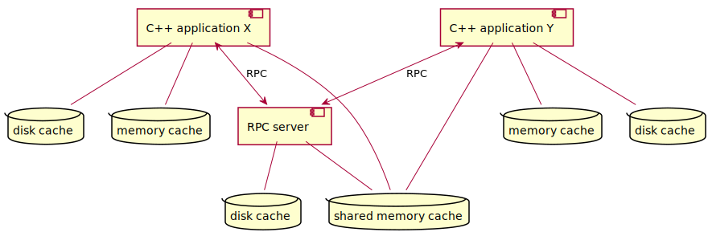

# Abstract
CRADLE is a C++ framework that intends to speed up lengthy calculations.
A calculation is modeled as a tree of subcalculations. Results of these subcalculations
are cached, so a following calculation that is similar to the previous one can use
these cached subresults, instead of calculating them again.

CRADLE is being used in the context of cancer treatment plans, where it achieves to bring
down the duration of re-calculations from several hours to several minutes.
In this context, a subcalculation is represented by a Thinknode request, so CRADLE
acts as a caching proxy for Thinknode.

More recent developments try to generalize CRADLE, so that it hopefully also becomes useful in other domains.
A calculation is now modeled as a [Merkle tree](https://en.wikipedia.org/wiki/Merkle_tree)
of _requests_, where resolving a request means calling a C++ _function_, which yields a _value_.

- A leaf in the Merkle tree is a constant value. This could be as simple as an integer constant.
  Another possibility is an image that is stored in unmodifiable form somewhere on the internet,
  and identified by its URL.
- A branch in the Merkle tree corresponds to a C++ function that takes one or more subrequests
  as its arguments, and returns a value.

There is a similarity between CRADLE and build systems like [Bazel](https://bazel.build/)
or [clearmake](https://help.hcltechsw.com/versionvault/2.0.1/oxy_ex-1/com.ibm.rational.clearcase.tutorial.doc/topics/a_clearmake.html).
These build systems also model their work as a Merkle tree, and cache intermediate results.
Nodes in the tree correspond to a file:

- A leaf in the tree corresponds to a source file.
- Evaluating a branch in the tree means invoking a compiler or other tool that takes one
  or more files as input, and produces another file.

## Caching
CRADLE caches results whenever possible; there are two levels:

* A primary memory cache (see below; default size: 4GB).
  Results are stored in their C++ native format.
* A secondary cache: a local disk cache (see below; default size: 4GB) or a [remote cache](remote_cache.md).
  Results are stored in serialized form; serialization typically is done via [cereal](https://uscilab.github.io/cereal/).

A request has an associated caching level, which is one of the following:

- Uncached. Appropriate for leaves in the calculation tree; could also be used for fast calculations.
- Memory cache only.
- Fully cached (memory cache and secondary cache).

Caching in secondary storage, but not in memory, is not possible with the CRADLE design.

### Memory cache
The memory cache stores results in their C++ native format (embedded in an `std::any`),
contained in an `std::unordered_map`. Advantages are:

- No need to serialize the values.
- The hash need not be unique, a "cheaper" implementation suffices.

A nice property of the memory cache is that when the same subrequest appears
multiple times in the calculation tree, and it is not yet cached, then it will be evaluated
only once; all other threads will block until the result is available.

### Local disk cache
The main local disk-based cache is formed by an SQLite database, which also contains small blobs.
Large blobs are compressed via LZ4 and stored in a file.

The disk cache is a key-value one. A key is represented by a hash
that must remain valid between application runs.

## RPC
On the same workstation, multiple applications could be using CRADLE simultaneously.
These applications could be interested in resolving the same (sub-)request, possibly even at the same time.
CRADLE offers an RPC mechanism so that the request will be resolved only once, and the result will be
available to all interested applications. This looks like:

An application still has the option to resolve a request locally, but 
normally it will have the server resolve the request.
If several applications want to have the same request be resolved at the same time,
the server ensures that it will do the calculation only once.

The request is communicated over an RPC channel. For a synchronous request, the caller will
block until the result is available. Results are usually returned across
that same RPC channel. However, a function can also select to put the result in shared memory;
this gives a significant speedup for large results (megabytes or even more).

The server also uses a disk cache that is functionally shared with the applications; however,
applications have no direct access to the cache.

The CRADLE framework offers an RPC server based on [rpclib](https://github.com/rpclib/rpclib),
which serializes messages using MessagePack. This library was selected for being easy to use;
alternatives include [libjson-rpc-cpp](https://github.com/cinemast/libjson-rpc-cpp)
and [gRPC](https://grpc.io/).

CRADLE also offers an in-process loopback server, which will be of limited practical use.
