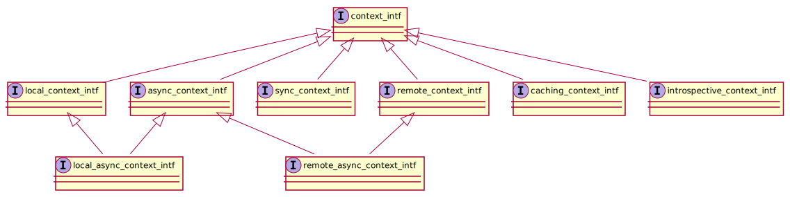
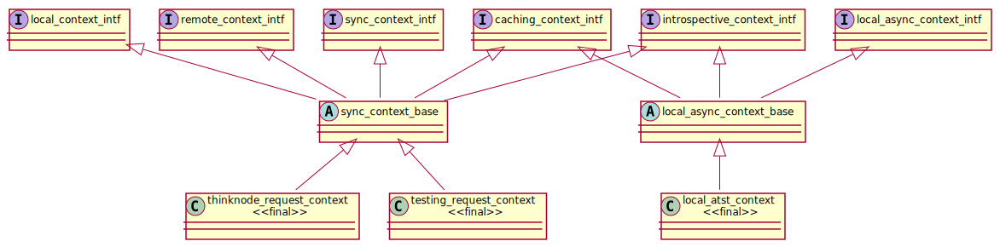

# Contexts
A _context_ is the runtime counterpart of a request. It provides the resources needed
to resolve the request, and can keep track of resolution progress.

CRADLE defines a hierarchy of context interface classes (defined in `inner/request/generic.h`):

A context implementation class implements one or more of these interfaces. By implementing
an interface, the class declares that it supports some way of resolving a request, and offers
that support.

* `context_intf` is the root interface. Normally, a function will receive a reference to this class,
    but it's not useful in itself. The request class embedding the function advertises the interfaces
    that the context _class_ for this function should implement, and the function could cast
    the `context_intf` reference to each of these interfaces.
* `local_context_intf`: support for locally (in-process) resolving a request.
* `remote_context_intf`: support for remotely (across an RPC channel) resolving a request.
* `sync_context_intf`: support for synchronously resolving a request.
* `async_context_intf`: support for asynchronously resolving a request.
* `local_async_context_intf`: support for resolving a request asynchronously, in-process.
* `remote_async_context_intf`: support for resolving a request asynchronously, across an RPC channel.
* `caching_context_intf`: support for resolving a request, caching the results.
* `introspective_context_intf`: support for introspection, providing progress information
    about on ongoing request resolution.

`inner/requests/context_base.h` defines a number of abstract base classes implementing
the major parts of these interfaces. A real (final) implementation class could derive
from an appropriate base class, and fill in the remaining details.

For locally resolving requests, the base classes are 
`sync_context_base` and `local_async_context_base`:

The diagram also shows some implementation classes: 
`thinknode_request_context` is used for resolving Thinknode requests, while
`testing_request_context` and `local_atst_context` are used in unit tests.

For resolving requests asynchronously across an RPC channel, the base classes
are `root_proxy_async_context_base` and `non_root_proxy_async_context_base`;
the first one should be associated with the root of a request tree, the latter
one with subrequests.

The `root_proxy_atst_context` and `non_root_proxy_atst_context` classes
are used in unit tests.
