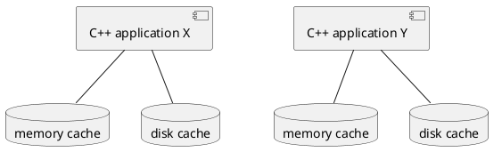
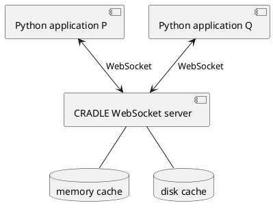
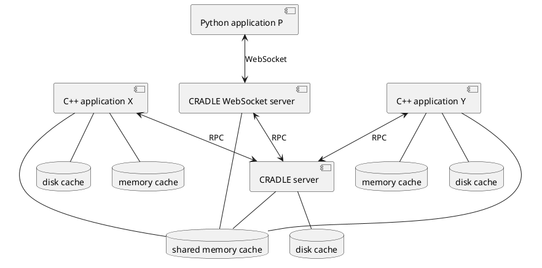

# Towards a CRADLE server

# Introduction
On the same workstation, multiple applications could be using CRADLE simultaneously.
These applications could be interested in resolving the same (sub-)request, possibly even at the same time.
In the current situation, all applications would perform the same calculation.
The only potential re-use would be sharing the disk cache, but 
the current disk cache implementation is probably not thread-safe (tbc).

As a first step towards solving these inefficiencies, we will introduce a CRADLE server process.
The server can be used by multiple applications simultaneously. It will
offer access to a shared memory cache, a shared disk cache,
and be able to resolve requests whose results are stored in those caches.
In some future stage the server could provide additional services, like acting
as a gateway to the cloud.

# Current architecture

CRADLE can be used by multiple applications simultaneously, where each application links
to the CRADLE library, and has its
own memory and disk cache. There is no re-use of cached results between the applications.

CRADLE already offers a Websocket interface that is used by Python applications:

# Introducing the CRADLE server
With the introduction of the CRADLE server, the architecture looks like this:

Applications still have the option to resolve requests locally; this could either be
an application-wide operation mode, or request-specific. It would avoid the overhead
(need to define a request UUID, serialization, RPC call) associated with going to the server.
The results from these requests would be stored in application-local memory and disk caches.

However, normally an application will have the server resolve a request.
If several applications want to have the same request be resolved at the same time,
the server ensures that it will do the calculation only once.

Resolving a request whose result is not yet cached means calling a function. Doing this outside
the current process basically is a remote procedure call (RPC). It is therefore logical to
have some kind of RPC protocol between applications and server. These protocols usually are
one way: an application makes an RPC request, and the server responds. The caller will block
until the response comes back.

The server stores results in a shared memory cache. Applications and server have direct access to this cache
(see below for details).
The cache contains blobs that are identified by their name.
The blobs are immutable, so no synchronization is needed for accessing them.
The memory cache is also used for storing large blobs that are part of a request.

The server also uses a disk cache that is functionally shared with the applications; however,
applications have no direct access to the cache.

In addition, the WebSocket server is still available as a separate process;
we shouldn't have to change anything there. However, if there is a significant overlap
of requests between C++ and Python applications (tbc), we could go for the solution depicted
in the preceding figure. The WebSocket server would become another C++ application and
access the main server across C++.
Of course, this means we will have to change the WebSocket-related code;
it should be possible to make the WebSocket server into a relatively simple translation
between the WebSocket and RPC protocols.
An alternative would be that the Python applications talk RPC.

## The RPC protocol
At its minimum, the RPC protocol should have the following messages:

- Resolve request synchronously. The RPC call blocks until the server has the result available.
- Acknowledge one or more shared blobs that were returned in a "resolve request" response.
  Until this acknowledgement comes, the server will hold a reference to the blob's shared
  memory chunk on behalf of the application, so that it won't release the chunk until the
  application has had the chance to claim its own reference (via an `mmap()` call).

It might be interesting for an application to know what is happening with a request
it submitted to the server. This leads to an asynchronous interface with some additional
messages:

- Resolve request asynchronously.
- Query the status of an ongoing asynchronous request.
- Get the response for a finished asynchronous request.

Implementing such an asynchronous interface will have a lower priority.

Note that the above gives a high-level overview of the messages we need to provide.
Mapping them into C++ and integrating with the current CRADLE framework will be a challenge.

## Choosing an RPC protocol and library
Various RPC protocols exist. In principle, the protocol should be independent of the transport
layer, for which several options exist:

- Sockets
- HTTP. This seems to be the most common, and is probably the easiest from development perspective.
  e.g., we could access the server using a simple `curl` command.
- Shared memory. It seems no RPC protocol yet uses this. Maybe sometime we could implement
  something using [iceoryx™](https://iceoryx.io/v2.0.2/).

The following RPC protocols look like the best candidates for us:

- [JSON-RPC](https://en.wikipedia.org/wiki/JSON-RPC)
- [MessagePack-RPC](https://github.com/msgpack-rpc/msgpack-rpc)
- [gRPC](https://grpc.io/)

### JSON-RPC
JSON-RPC looks simple, flexible and convenient. E.g., we could serialize requests into JSON
and embed them in the JSON messages, and get something readable back from `curl`.

There are a few C++ libraries implementing JSON-RPC.
[libjson-rpc-cpp](https://github.com/cinemast/libjson-rpc-cpp) looks promising.
On Linux systems, it can simply be installed via the package manager (e.g. `apt-get`).
Windows installers are available, but only for very old versions.
Building from source looks complicated, and almost impossible for Windows.
So, unfortunately we cannot use this.

The same author has created a newer [C++-17 header-only derivative](https://github.com/jsonrpcx/json-rpc-cxx).
It's not being used much, but looks simple and easy to use,
though that's somewhat hard to judge due to lack of documentation.
Data types exchanged over this interface will have to support serialization from/to
`nlohmann::json`, as described [here](https://github.com/nlohmann/json#arbitrary-types-conversions).

### MessagePack-RPC
Similar to JSON-RPC, but using MessagePack; messages will be smaller but unreadable.

The protocol is implemented in the [rpclib](https://github.com/rpclib/rpclib) library.
It is well [documented](http://rpclib.net/), but "rpclib is looking for maintainers".

We would now have to serialize data types from/to MessagePack; see
[here](https://github.com/msgpack/msgpack-c/wiki/v1_1_cpp_adaptor).
It doesn't look as easy as the `nlohmann::json` approach.

### gRPC
gRPC is more heavyweight, e.g. has built-in authentication.
Having to fill in the gRPC protocol buffers looks inconvenient.
Like MessagePack-RPC, gRPC uses a binary serialization so messages
should be smaller than JSON ones.

### Conclusion
The choice is between JSON-RPC with the `json-rpc-cxx` library, or
MessagePack-RPC with the `rpclib` library. There is no clear winner; we probably
should experiment with both.

## Error handling
By offloading functionality from the application to a server, more can go wrong.
As long as we stay on the same machine, error sources and impact will be limited.

# Future directions
1. Put some of the services that we need (execution, storage, caching) into the cloud.
   Access will probably be via the CRADLE server.

# Details
## Shared blobs
On Linux, shared memory is accessed via the
[POSIX shared memory API](https://man7.org/linux/man-pages/man7/shm_overview.7.html).
The name of a blob is what is passed to `shm_open()`.

Windows does not implement the POSIX API. Instead, we can use
[Boost shared memory](https://www.boost.org/doc/libs/1_80_0/doc/html/interprocess/sharedmemorybetweenprocesses.html).
It looks convenient to also use Boost for Linux, even though the APIs differ somewhat between the two
systems; i.e., our code will need some `#ifdef` constructs.

## CRADLE request
### Request contents
A CRADLE request at least contains:

- Some identification of the function to execute
- Function arguments (common data types / shared blob / subrequest)
- In a C++ context, the value type should be a template argument (maybe the only one?).
  In JSON, the value type could be implied.
- In the current C++ implementation, the caching level is a template argument. Maybe this should change.
- In the current C++ implementation, the introspection flag is a template argument. Maybe this should change.

When resolving a request, there will be a "context".

Some information could be put either in the request itself, or the resolution context,
or passed as parameter to the "resolve request" call:

- Resolver: simple (local) / server (via RPC) / other
- Caching: memory only / memory+disk / other
- Synchronous / asynchronous resolution

### Request serialization
A request needs to be serialized before it can be sent across RPC. We already have
a cereal-based serialization but this looks too low-level, containing too many
details from the C++ implementation. We will have to:

- Revise the serialization (can we still use cereal?)
- Add support for shared blobs

## RPC request
- Terminology (e.g. "CRADLE request" vs. "RPC request")
- More details of what's in an RPC request
- How does it map onto the current CRADLE?
- (Lower prio) Refer to CRADLE (sub-)requests by id, and put their definitions in some shared storage
- More...
