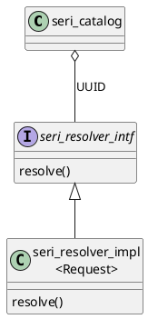
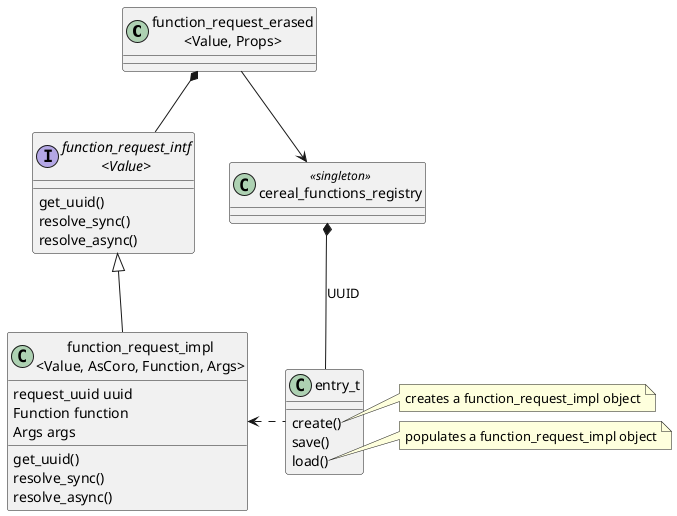
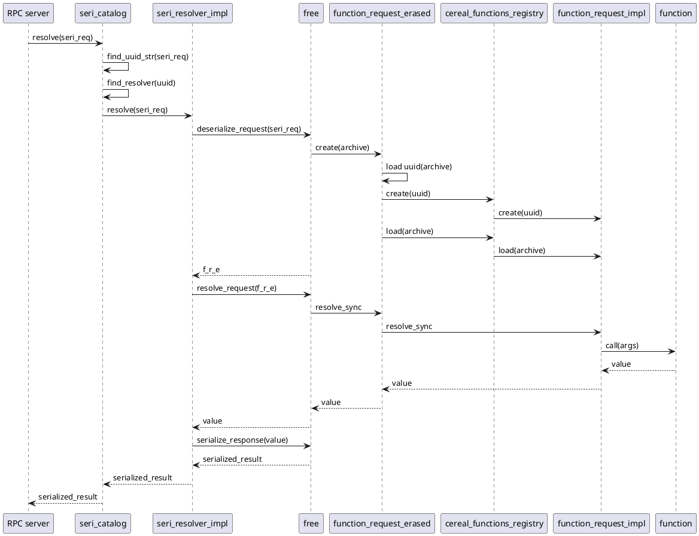

# Resolving a serialized request
A request is serialized into a JSON structure, using the
[Cereal](https://uscilab.github.io/cereal/) library. An example is
```
{
    "uuid": "rq_post_iss_object+full",
    "title": "post_iss_object",
    "args": {
        "tuple_element0": "123",
        "tuple_element1": "string",
        "tuple_element2": {
            "uuid": "uuid_100_2",
            "title": "make_blob_coro",
            "args": {
                "tuple_element0": {
                    "value0": "payload"
                }
            }
        }
    }
}
```
This encodes a "post ISS object" request, where one of the arguments is a "make blob coro" subrequest.

The `uuid` value for a request specifies the function to call for that request, plus the exact
types of any template classes involved. The `title` values are used in introspection.
The `args` specify the arguments to pass to the function. They are encoded as an object
with a number of `tuple_element_X` keys rather than a JSON array, which appears to be a Cereal
idiosyncrasy.

## UUIDs
Each request is identified by a UUID (universally unique identifier). The ones in the example don't
look really unique; in a real-life situation, they should be based on e.g. an RFC 4122 version 4
(random) value. The first UUID has a "+full" postfix indicating that the request should be fully cached
(using the memory cache and a secondary cache).

A UUID defines the types of the objects involved in the deserialization process, and the function
to call. Basically, resolution happens in two steps:
1. Use the UUID to find a resolver in the catalog of registered resolvers (`class seri_catalog`).
2. Invoke the resolver, which translates the serialized request into a serialized result, again
   using the UUID, in a way depending on the request type.





A resolver is accessed via the type-erased `seri_resolver_intf` class. The actual type is an instantiation
of the `seri_resolver_impl` template class, which has the request type as template parameter.
The instantiation must have been registered before, with the same UUID value.

## `function_request_erased`
For a request based on the `function_request_erased` template class, deserialization creates
a `function_request_erased` and a `function_request_impl` object.



`function_request_erased` is a type-erased template class that hides the function, and the function's
arguments. It has two template parameters: `Value` and `Props`.
* `Value` is the type of the request's return value.
* `Props` defines several properties.
   One of them is the caching level, explaining the `+full` postfix in the example.

The UUID defines the exact `Value` and `Props` types.

A `function_request_erased` object holds a pointer to a `function_request_intf` interface
class, which only has `Value` as template parameter. The interface is implemented by a
`function_request_impl` instantiation, whose template parameters include the function and
argument types.

For these requests, the UUID defines:
* The type of the `function_request_erased` instantiation; this includes the type of its `Props` instantiation.
* The type of the `function_request_intf` instantiation (i.e., `Value`).
* The type of the `function_request_impl` instantiation; this includes the `Function` type.
* If `Function` is a C++ function (not a class): the function address.
* A `cereal_functions_registry::entry_t` object, containing functions to create, serialize
  and deserialize (populate) a `function_request_impl` instantiation.


## Sequence diagram
The following sequence diagram shows how a serialized `function_request_erased` request is resolved
in the simplest of cases: synchronously, where there are no subrequests.



Note: "free" is a placeholder for free functions, that are not member functions of any class.

An RPC server receives a serialized request (`seri_req`) from a client over some sort of RPC connection,
and has to return the result in serialized form (`serialized_result`) to the client. Requests are serialized
into JSON using Cereal, results are serialized into a msgpack format.

The RPC server dispatches the resolve request to the `seri_catalog` instance, which is a registry of all
supported seri resolvers. A seri resolver is able to resolve exactly one type
of request, e.g. a `function_request_erased` instantiation; it is a `seri_resolver_impl`
template class having that `function_request_erased` instantiation as template parameter.
A seri resolver is identified by a UUID,
so the first thing the `seri_catalog` does is to extract the UUID value for the main request from
the serialized request. At this point, the rest of the serialized request is irrelevant, so the UUID
extraction happens via a simple textual search, rather than decoding the JSON.

Once the `seri_catalog` instance has extracted the UUID and found the corresponding resolver,
it dispatches the resolve request to that resolver. The resolver first deserializes
the request into the corresponding `function_request_erased` (`f_r_e`) instantion object, by
calling `deserialize_request()`. This converts the serialized data into a corresponding
`cereal::JSONInputArchive` object, and passes that to a `function_request_erased` constructor.

The `function_request_erased` instantiation is a type-erased class that refers to a
`function_request_intf` interface. To create the correct `function_request_impl` instantiation 
implementing that interface, the UUID is needed once again. This time, the UUID is extracted
via a normal JSON lookup operation. The UUID is used to look up a pair of `create` and `load`
functions in the `cereal_functions_registry` instance, where they are added when a request
type is registered with the `seri_catalog` instance. The `create` function creates a skeleton
`function_request_impl` object, and `load()` populates it via Cereal.

The `function_request_erased` object is now ready to be resolved. The resolver passes the object
to the `resolve_request` free function, which detects that the request should be resolved
synchronously, so calls `function_request_erased::resolve_sync()`. This leads to a call
of the request's function with the arguments that were encoded in the serialized request.
The function's result value is propagated back to the resolver, which serializes the value,
and returns the serialized result back to the RPC server.
